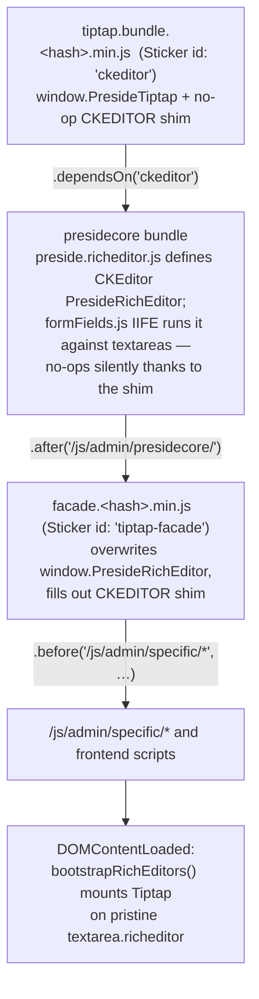
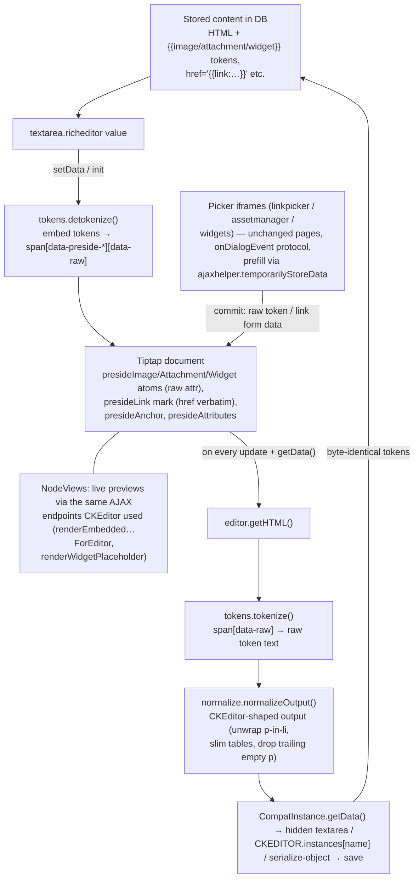

# Architecture

`preside-ext-tiptap` is a Preside CMS extension that replaces the vendored
CKEditor 4 rich editor with a self-contained Tiptap v3 editor. It is a
**drop-in replacement**: it reproduces Preside's editor integration contract
exactly (globals, registries, event names, stored-content token format, picker
protocol), so no other Preside code — forms, renderers, AJAX endpoints, picker
pages — has to change. It makes **zero core Preside edits**; everything is done
through extension-level override mechanisms.

The codebase is deliberately layered. From the bottom up:

1. **Core Tiptap** — stock Tiptap v3 packages providing the editing engine.
2. **Custom Tiptap extensions + supporting modules** — Preside-specific nodes,
   marks, serialization, styling and picker plumbing.
3. **The Preside shim/facade layer** — the CKEditor-shaped API surface, plus
   the CFML-side integration (Sticker asset-id override, view override).

---

## Layer 1: Core Tiptap

Declared in `package.json`, imported in `src/index.js`, bundled into
`assets/dist/tiptap.bundle.min.js` (exposed as `window.PresideTiptap`).

| Package | What it provides |
|---|---|
| `@tiptap/core` | `Editor`, `Extension`, `Node`, `Mark`, `mergeAttributes` — the editor engine and extension primitives. Re-exported on `window.PresideTiptap` so the facade and custom extensions can use them without a second copy. |
| `@tiptap/pm` | The bundled ProseMirror packages (`presideLink.js` imports `Plugin` from `@tiptap/pm/state` for its double-click handler). |
| `@tiptap/starter-kit` | Paragraphs, headings, bold/italic/strike/underline, lists, blockquote, code block, horizontal rule, history (undo/redo), etc. The facade configures it with **`link: false`** — StarterKit's Link mark is disabled because `PresideLink` owns link parsing/serialization. |
| `@tiptap/extension-subscript` / `-superscript` | The `Subscript` / `Superscript` toolbar buttons. |
| `@tiptap/extension-text-align` | `JustifyLeft/Center/Right/Block`, configured for `heading` + `paragraph`. |
| `@tiptap/extension-table` (`TableKit`) | The `Table` toolbar button — registers Table + TableRow + TableHeader + TableCell in one kit (`-table-cell/-header/-row` are direct deps of the kit). |
| `@tiptap/extension-placeholder` | Placeholder text, wired from the textarea's `placeholder` attribute / `ckeditorDefaultPlaceholder`. |

`src/index.js` assembles these plus the custom extension **factories** into
`window.PresideTiptap = { Editor, Extension, Node, Mark, mergeAttributes,
StarterKit, extensions: { … }, version }`. The subscript/superscript/
text-align/table/placeholder set is grouped behind
`extensions.buildRichText(cfg)` and instantiated per-editor by the facade.

`src/index.js` also contains something that is *not* Tiptap at all: a
**pre-presidecore `CKEDITOR` global shim** (see Layer 3) — it lives here
because this bundle is the script that loads *before* presidecore.

---

## Layer 2: Custom Tiptap extensions and supporting modules

All custom extensions are exported as **factory functions**
(`createPresideX(deps)`) rather than singletons, so per-editor config
(picker categories, `buildAdminLink`/`buildAjaxLink`) can be injected by the
facade and the harness can inject mocks.

### The token contract (why most of this layer exists)

Preside stores rich content with placeholder tokens that the server-side
`ContentRendererService` expands at render time:

```
{{image:<urlencoded-json>:image}}
{{attachment:<urlencoded-json>:attachment}}
{{widget:<widgetId>:<urlencoded-json>:widget}}
```

and link hrefs of the form `{{link:<pageId>:link}}[#anchor]`,
`{{asset:<assetId>:asset}}`, `{{custom:<base64-json>:custom}}`.

Server-side renderers, forms and AJAX endpoints all assume this stored markup
is byte-identical after a round trip through the editor. **The tokens are the
persistence format; the editor-internal representation is a client-side
detail.**

### `src/tokens.js` — embed token ⇄ placeholder conversion

- `detokenize(stored)` (on load / `setData`): regex-replaces each
  image/attachment/widget token with a placeholder element the custom nodes'
  `parseHTML` recognises:
  `<span data-preside-image="true" class="img-placeholder" data-raw="{{image:…}}"></span>`
  (mirrors CKEditor's dataFilter text rule). Link tokens are **not** touched —
  they live inside `href` attributes and belong to `PresideLink`.
- `tokenize(html)` (on save / `getData`): a DOM pass that replaces every
  `[data-raw]` element with a text node containing its raw token — the exact
  original bytes. Only the embed nodes carry `data-raw`, so this is targeted.

### `src/extensions/presideEmbeds.js` — `presideImage`, `presideAttachment`, `presideWidget`

One generic `makeEmbedNode(opts, deps)` produces all three. Each is an
**inline atom node with a single `raw` attribute** holding the untouched token
string:

- `parseHTML` matches `span[data-preside-*]` (what `detokenize` emitted) and
  reads `data-raw`.
- `renderHTML` emits the same placeholder span back, so `tokenize()` can
  restore the raw token verbatim. The token is never parsed into a structured
  model — byte fidelity by construction.
- A **NodeView** renders a live preview by POSTing to the *same* AJAX
  endpoints the CKEditor widgets used:
  `assetManager.renderEmbeddedImageForEditor`,
  `assetManager.renderEmbeddedAttachmentForEditor`,
  `widgets.renderWidgetPlaceholder`.
- Commands per node: `insertPresideX(raw)` and `openPresideXPicker()`
  (opens the real Preside picker page via `presidePickerModal.js`).
- **Double-click** an embed selects the node and re-opens its picker
  prefilled (widget id + config JSON extracted from the raw token) — commit
  then does `updateAttributes` (edit-in-place) instead of insert.

### `src/extensions/presideLink.js` — the `presideLink` mark

Replaces StarterKit's Link mark. Stores `href` **verbatim** — including
`{{link}}`/`{{asset}}`/`{{custom}}` tokens — plus
`target`/`rel`/`title`/`referrerpolicy`. `renderHTML` emits only non-null
attributes so stored markup stays clean. Commands:

- `openPresideLinkPicker()` — opens Preside's real link-picker iframe
  (`linkpicker.index`), prefilled from the current mark's parsed attributes
  when editing an existing link; also passes the document's anchor names
  (collected from `presideAnchor` nodes) so the picker's "anchor" type works.
- `applyPresideLink(data)` — converts link-form data to attributes via
  `getLinkAttributes()`; inserts link text when the selection is empty,
  otherwise `extendMarkRange().setMark()`.
- `unsetPresideLink()` — removes the mark.

A small ProseMirror plugin opens the picker on **double-click** of a link.

### `src/presideLinkSerialization.js` — the byte-exact link-token codec

`getLinkAttributes(data)` / `parseLinkAttributes(attrs)`, **ported verbatim**
from CKEditor's `presidelink/plugin.js`. Pure and framework-agnostic
(unit-tested standalone in `harness/test-link-serialization.mjs`). Handles all
Preside link types: sitetree link, asset, url, anchor, email (including the
`javascript:void(location.href='mailto:'+String.fromCharCode(…))` anti-spam
encoding, default protection mode "encode"), email variable, and the
`{{custom:base64(json,v:2):custom}}` fallback. Also `pickerScalar()` — unwraps
Preside object-picker values that arrive as JSON-array strings (`["PAGE-1"]`)
so the raw array text never leaks into a token. The rare CKEditor
"custom-function" email-protection mode is deliberately not ported.

### `src/extensions/presideAnchor.js` — named anchors

Inline atom node reproducing CKEditor's anchor plugin. Parses empty,
href-less `<a name|id|data-cke-saved-name>` elements (content-bearing anchors
are left alone), renders back `<a id="name" name="name"></a>`. A NodeView
shows a visible ⚓ marker; double-click edits the name via a small self-built
overlay dialog (no Preside picker — CKEditor's anchor dialog was also just a
single text field). These nodes feed the link picker's anchor list.

### `src/extensions/presideAttributes.js` — attribute fidelity

Two pieces preventing round-trip data loss (StarterKit drops unknown
attributes):

- `createPresideAttributes()` — an `Extension` adding global `class`/`style`
  passthrough attributes to all block-ish types (paragraph, headings, lists,
  table nodes, blockquote, codeBlock).
- `createPresideInlineStyle()` — a low-priority `span` mark that keeps
  `class`/`style` on inline spans, explicitly declining the embed placeholder
  spans and spans with neither attribute.

This is what the stylesheetParser-style "Styles" dropdown applies. It also gives
StarterKit's `bold`/`italic` marks a `class`, and `presideInlineStyle` a `tag`
attribute (`span`|`small`), so a `strong.text-danger` / `small.text-muted` style
round-trips as its own element rather than being flattened to a span.

### `src/normalize.js` — output normaliser

Applied in `getData()` **after** `tokenize()`. Brings Tiptap's serialized
HTML closer to CKEditor's stored form so migrating an existing corpus produces
clean diffs instead of churn: unwraps a single attribute-less `<p>` inside
`li/td/th/blockquote`; slims table markup (drops `<colgroup>`, table `style`,
default `colspan/rowspan="1"`); drops one trailing empty `<p>`. Idempotent by
design; a `<p>` carrying class/style is left wrapped so attributes are never
lost.

### `src/presideStyles.js` — content CSS, and the Styles dropdown's input

CKEditor edited inside an iframe, so site content CSS could load there without
touching admin chrome; this extension is back to doing the same (see
`src/editorFrame.js`), so the module is small:

- `injectFrameStyles( doc, csv, onLoad )` — one **unmodified** `<link>` per URL into
  a frame's head. Two callers: the editing frame, and the Format/Styles dropdown
  panel (`src/comboPanel.js`), which is an iframe for exactly this reason.
- `harvestSelectors( doc )` — the raw selector list from a document's own sheets,
  read off the CSSOM. It is the Styles dropdown's input, and it is what CKEditor's
  `stylesheetparser` reads too (`h( editor.document.$, … )`).

An earlier version fetched each sheet and re-injected a copy scoped to
`.tiptap-editor-mount .ProseMirror` / `.tiptap-fmt-preview`, with `rem` rebased.
That path is **gone** — see CLAUDE.md, "Nothing transforms content CSS any more",
for why it could not be made correct.

### `src/presidePickerModal.js` — the picker iframe + `onDialogEvent` protocol

A CKEditor-"dialog"-shaped modal hosting a Preside admin picker page in an
iframe, speaking the exact protocol the existing picker pages implement — so
`linkpicker`, `assetmanager.pickerForEditorDialog` and `widgets.dialog` are
**reused verbatim, unmodified**:

- On iframe `load` (and OK/Cancel), it calls
  `iframe.contentWindow.onDialogEvent({ name, sender: dialog }, dialog)`.
  Returning `false` from the `ok` event keeps the dialog open (validation).
- The `dialog` object provides exactly the surface the picker behaviour files
  touch: `enableButton/disableButton("ok")`, `getContentElement("iframe")`
  (a stand-in element the iframe writes `_config` / `_widgetConfig` onto),
  `commitContent()` (reads that value and calls the caller's `onCommit(raw)`),
  `hide()`, `click("ok")`, `getParentEditor()`, `_plugin`
  (the link picker calls `dialog._plugin.updateLink(data, dialog)`), and
  `_.selectedElement` (edit vs insert detection).
- **Prefill** works the same way CKEditor's dialogs did: the data is POSTed to
  `ajaxhelper.temporarilyStoreData` (FlashRAM) *before* the iframe navigates
  to the picker URL; the picker page then reads it server-side.
- `postForm()` is a small fetch-based, form-encoded POST helper (also used by
  the embed NodeView previews).

### `src/toolbar.js` — CKEditor button names → Tiptap commands

Preside toolbars are pipe/comma strings of **CKEditor button names**
(`"Bold,Italic|Widgets,ImagePicker"`); the facade parses them with a verbatim
port of core's `parseToolbarConfig`. `toolbar.js` maps each name to a
`{ label, title, run(editor), active(editor) }` entry — unknown
names are skipped gracefully. Highlights:

- Button icons are **inline SVGs from `src/icons.js`** (Tabler Icons, MIT) —
  bundled into the js, sized/coloured by the `.tiptap-btn svg` CSS rule. No
  icon files are shipped and no CKEditor assets are used.
- Preside-specific buttons (`PresideLink`, `PresideUnlink`, `PresideAnchor`,
  `Widgets`, `ImagePicker`, `AttachmentPicker`) invoke the custom extensions'
  commands.
- `Format` and `Styles` are CKEditor's two **richcombos**, and are ports of its
  real behaviour — see CLAUDE.md, "The Styles and Format dropdowns", for the
  upstream sources and every rule. In outline:
  - Both render their menu in an **iframe** with the site's content CSS linked
    unmodified (`src/comboPanel.js`), because that is the only way an entry can
    preview in real content typography. This is CKEditor's own
    `panel:{ css:[…].concat( contentsCss ) }` + `isFramed = css.length`.
  - Both are `canGroup:false`, so each renders as its own toolbar block rather
    than inside a `.tiptap-toolbar-group`.
  - `Format` is driven by `defaultConfigs.format_tags` (incl. `div` via the
    `presideDiv` node); entries are real `h1…h6/p/pre/div` elements.
  - `Styles` harvests `element.class` pairs from the editable's own stylesheets
    using stylesheetparser's exact normalisation, filtered by
    `stylesheetParser_validSelectors`/`_skipSelectors`, plus static
    `defaultConfigs.stylesSet` entries. Entries are then gated by CKEditor's
    `checkApplicable` (block/inline/object) and grouped by type; the combo
    **disables** when nothing applies at the caret.
  - Block styles set `class` on the node (via `presideAttributes`); inline styles
    resolve onto `presideInlineStyle` (`span`/`small`) or StarterKit's
    `bold`/`italic` (`strong`/`b`, `em`/`i`), which carry a `class` for this.
- `Source` toggles a raw textarea view showing **tokenized** HTML (the stored
  form) and re-parses it (`detokenize` → `setContent`) on toggle back.
- `Maximize` calls `src/maximize.js`, which **portals the container to `<body>`**
  and adds `is-maximized` (CSS handles full-screen). The portal is what makes it
  work on the front end, where the editor sits inside a fixed, `max-width:810px`,
  `z-index:100` wrapper that would otherwise clip it and trap it under the admin
  toolbar. Inline `width`/`max-height` (from the field's config) are parked and
  restored, `<html>` gets `.tiptap-maximized-host` (scroll lock), and the exact
  DOM position is restored on exit — including from `destroy()`.
- **Front-end editor width**: core's wrapper caps the editor at `max-width:810px`
  (~half the viewport on a desktop) and the field renders `data-width="800"` as an
  inline style. `src/tiptap.css` overrides both — the wrapper to `75vw` (core's
  `min-width:500px` still floors narrow screens) and the container to `width:100%`
  (`!important`, to beat the inline style) — so a non-maximized front-end editor
  gets ~75% of the viewport. The same block lifts the height: the field's inline
  `data-max-height` (400) is overridden to `max(240px, calc(100vh - 290px))` —
  the wrapper's `top:100px` + `padding-bottom:100px` (fixed save bar) plus ~90px
  of toolbar/footer chrome — so the editable fills the available space instead of
  stopping at 400px. Admin editors are unaffected (different wrapper).
- The **light/dark toggle** is rendered by `src/theme.js` and placed
  right-aligned in the **footer status bar** (`.tiptap-footer-right`) — the
  toolbar only builds one when a toolbar config names it explicitly (`Theme` /
  `DarkMode`), or when the footer is disabled (`wordcount = false`), in which case
  it goes to `.tiptap-toolbar-right`. `buildToolbar()` returns
  `{ themeEnabled, themeRendered }` so the facade can decide. `darkMode = false`
  suppresses it entirely. See `src/theme.js` below.
- Active-state highlighting refreshes on every `selectionUpdate` /
  `transaction`.

### `src/outline.js` — document outline navigator

A collapsed **rail** of short horizontal lines pinned to the right edge of the
container — one per heading, width derived from the heading level — which expands
on hover / focus / click-to-pin into a panel of heading titles. Clicking a line
or an entry puts the caret in that heading and scrolls it into view; the current
heading highlights as you scroll past it.

- **Adaptive detail** (`railPlan()`): it renders the **deepest heading level
  whose headings all fit** (h1–h6, then h1–h5, …, never shallower than the
  shallowest level the document actually uses — many documents start at h2), and
  if even those outnumber the room available it takes **every Nth**
  (`.is-sampled`; `.is-partial` marks any coarsening). 90 headings in a
  400px-tall editor becomes ~15 markers, which reads far better than 90 clipped
  or hair-thin lines.
- **One plan, two renderings**: the rail and the hover panel are built from the
  same entry list, so the panel is the labels *for the markers* and can never
  list a heading the rail does not mark. Capacity is therefore
  `min( rail rows, panel rows )` — `(editable − 24)/8` vs `(editable − 20)/24` —
  and the panel's taller rows normally bind, which is what keeps both lists inside
  the editor with nothing scrolling. The trade-off is deliberate: on a heading-
  heavy document some headings are not reachable *from the outline* (click the
  nearest and scroll), rather than the panel growing past the editor.
- **Vertically centred on the editable**, at any heading count. The panel is
  positioned **out of flow** for this reason: as a hidden flex sibling it still
  contributed its full height, so the wrapper grew with the heading list and the
  top-aligned rail drifted upwards. `place()` then sets the wrapper's `top` in px
  from the editable's own box rather than relying on `top:50%` of the container,
  whose centre is ~20px lower whenever the toolbar wraps to two rows.
- Capacity is **measured from the mount**, not read from the stylesheet: the
  computed value of a percentage `max-height` stays a percentage, so it is not
  readable in px — and for the same reason neither list can bound itself with a
  percentage `max-height` (the wrapper's height is capped, not set, so the
  percentage does not resolve). The panel keeps a px `max-height` set by `place()`
  as a belt, in case font metrics make a row taller than `PANEL_ROW_HEIGHT`.
- The **active heading** is derived from scroll position while scrolling (the
  mount when it is the scroller, otherwise the window; rAF-throttled) and from
  the caret otherwise. Because the rail is a subset of the headings, it lights
  the marker at or above the active one, while the panel highlights the exact
  entry and keeps it scrolled into view.
- **Chrome, not content**: the rail is appended to `.tiptap-editor-container`
  (not into the editable), so `getData()` is unaffected and the rail does not
  scroll away with the text — the scroll container is `.tiptap-editor-mount`, one
  level in.
- **Hit-testing**: the wrapper is `pointer-events:none` and only the drawn rows
  (and the open panel) take pointer events, so the right-hand edge of the
  editable stays clickable everywhere a line is not physically drawn.
  `.tiptap-outline:hover` still matches, because the hit target is a
  `pointer-events:auto` descendant.
- **Scrolling** targets the mount directly when it is the scroller (a field
  `maxHeight`, or maximized) rather than `scrollIntoView()`, which would also
  move the surrounding admin page. When the field is showing all of its content,
  clicking scrolls **nothing** — the caret and the highlight are the whole result;
  the page is only moved (by `block:"nearest"`, the least that reveals it) when
  the heading is actually outside the viewport, which a tall uncapped field can
  manage.
- The **"you landed here" highlight** is a ProseMirror **node decoration**, not a
  class on the rendered heading: the next DOM sync rewrites node attributes from
  the schema and would wipe it. Decorations are view-only, so no `update` fires
  and the form does not become dirty. It needs `Plugin` / `PluginKey` /
  `Decoration` / `DecorationSet`, which `src/index.js` exports on
  `window.PresideTiptap` for this purpose; the highlight degrades to nothing if
  they are missing.
- Rebuilt on every `docChanged` transaction (headings are few, the DOM is tiny),
  and the rail is re-planned on resize (`ResizeObserver` on the mount — maximize,
  window resize). No headings ⇒ the whole control is hidden (`.is-empty`).
- **Palette**: every colour is a `--tt-*` variable mapped to a Preside admin
  colour (`colours.less`) - `@pale-blue` row hover, the `@blue` tree-list
  highlight bar for the current entry, `@grey12`/`@blue-darker` rail markers, and
  the admin's highlight `@yellow` for the landed-on heading (deliberately not
  another blue, which everywhere else in the chrome means "selected"). The
  mapping table lives in the `src/tiptap.css` header.
- The panel deliberately has **no visible title** - the list is self-evident;
  `outline.title` survives as the landmark's `aria-label`.
- Opt out per site/field with `defaultConfigs.outline = false`. Strings are the
  `outline.*` i18n keys.

### `src/theme.js` — light/dark chrome theme

The theme is **chrome only**: it toggles `.tiptap-dark` on the editor container,
which flips the `--tt-*` custom properties that every chrome colour in
`src/tiptap.css` reads. The document is never touched, so `getData()` is
byte-identical in either mode — and a field's content stylesheets keep their
explicit colours inside the editable (WYSIWYG fidelity wins over a uniformly
dark surface).

The choice is a per-**user** preference (`localStorage.presideTiptapTheme`,
default light), not per-field config: `setTheme()` re-themes every
`.tiptap-editor-container` in the document and re-syncs every toggle button's
icon/tooltip, and `applyTheme()` runs as each editor mounts. Walking the live
DOM (rather than keeping a listener registry) is deliberate — editors are
created and destroyed freely by frontend editors and quick-add modals.

---

## Layer 3: The Preside shim/facade layer

### `src/facade.js` — `window.PresideRichEditor` (Tiptap-backed)

Core presidecore's `preside.richeditor.js` defines the CKEditor-backed
`window.PresideRichEditor` at parse time. This facade loads **after**
presidecore and overwrites that global — but runs before DOM-ready, when
`formFields.js` would bind `$('textarea.richeditor')`.

**Bootstrap subtlety:** `formFields.js` actually instantiates the *CKEditor*
`PresideRichEditor` synchronously at parse time (inside its IIFE), before the
facade loads. The pre-presidecore `CKEDITOR` shim at the top of `src/index.js`
turns that path into a silent no-op (`CK.replace()` returns a dead stub), so
the textareas are still pristine when the facade's own
`bootstrapRichEditors()` scans `textarea.richeditor:not(.frontend-container)`
on DOMContentLoaded and mounts Tiptap, guarding with a
`data-tiptap-mounted` attribute. `PresideRichEditor.bootstrap` is exposed so
AJAX-loaded forms (quick-add modals) can re-scan.

Without that shim, presidecore would throw `CKEDITOR is not defined` and abort
the rest of `formFields.js` (popovers, date pickers, file inputs…). The shim
provides: `CKEDITOR.instances`, the `ENTER_*` / `CTRL/SHIFT/ALT` constants,
no-op `on`/`replace`, and `CKEDITOR.document.$ = document` — the latter
because `preside.iframe.modal.js` (nested picker modals: the widget/image "+"
and edit-pencil buttons) reads `parent.CKEDITOR.document.$` and would throw
mid-open otherwise. The facade re-asserts the same minimal shim defensively.

**Per-instance flow** (`PresideRichEditor.prototype.init`):

1. `readConfig()` mirrors core exactly — reads `data-toolbar`, `data-width`,
   `data-min/maxHeight`, `data-stylesheets`, `data-widgetCategories`,
   `data-linkPickerCategory`, placeholder etc., falling back to the
   `cfrequest` values that the `ckEditorJs.cfm` view's `includeData` provides.
2. Hides the textarea (kept in the form for native submit), mounts
   `.tiptap-editor-container` (toolbar div + editor mount) after it.
3. Creates the Tiptap `Editor` with `content: detokenize(ta.value)` and the
   extension stack built in `buildExtensions()` (StarterKit minus link,
   attributes, link, anchor, embeds, rich-text kit).
4. Points `tiptap.view.dom.form = ta.form` — **jquery.validate workaround**:
   its delegated focus/keyup handler on `[contenteditable]` reads `this.form`
   before any ignore check; CKEditor's iframe hid the editable from those
   delegates, Tiptap's inline editable would make every keystroke throw.
5. Wraps the editor in a `CompatInstance`, registers it in
   `CKEDITOR.instances[name]` and `$ta.data("ckeditorinstance", instance)`,
   snapshots `initialdata`, writes normalized data back into the textarea,
   builds the toolbar, applies content styles, and fires `instanceReady`
   asynchronously (so callers like frontendEditors can attach handlers first).

**`CompatInstance` — the CKEditor-shaped API Preside actually consumes:**

| Member | Consumer / behaviour |
|---|---|
| `getData()` | `normalizeOutput(tokenize(tiptap.getHTML()))` — the save path. Used by serialize-object (AJAX submit), dirtyforms, validation. |
| `setData(html)` | `setContent(detokenize(html), { emitUpdate: false })` — quick-add reset, frontend version restore. |
| `initialdata` | dirtyforms comparison baseline. |
| `on / fire` | simple handler registry; `on("key", …)` additionally binds a real `keydown` listener with CKEditor-shaped `{ data: { keyCode, domEvent } }`. `change` is emitted on every Tiptap `update` (which also syncs the hidden textarea). |
| `focus()` | Tiptap focus. |
| `destroy()` | mirrors CKEditor: tears down the editor DOM, restores the textarea, deregisters from `CKEDITOR.instances` and the jQuery data — frontend editors create/destroy on every edit-mode toggle. |
| `execCommand("maximize")` / `commands.maximize.state` | fullscreen toggle, state tracked for callers that read it. |
| `getSelection()` | returns `null` (stubbed). |

Every Tiptap `update` syncs `getData()` into the hidden textarea, so plain
(non-AJAX) form posts also carry current content.

### CFML side: how the extension plugs in

**`assets/StickerBundle.cfc` — the asset-id override trick.** Preside
registers every extension's `assets/` directory as a Sticker bundle *after*
the core bundle (`StickerForPreside.cfc`); a re-declared asset **id** wins. So
this bundle re-declares core's `ckeditor` id to point at
`tiptap.bundle.min.js` — every existing `event.include("ckeditor")` call-site
in core now loads Tiptap, with no core edit (same mechanism as
`preside-ext-jsmodern`). It also declares `tiptap-facade` and `tiptap-css`,
and encodes the load-order rules declaratively:

```
bundle.asset( "tiptap-facade" )
      .dependsOn( "ckeditor" )
      .after( "/js/admin/presidecore/" )
      .before( "/js/admin/specific/*", "/js/admin/frontend/*" );
```

Cache busting is **filename-based**: the build emits content-hashed filenames
(`facade.<hash>.min.js`) and each asset is declared with a **Sticker wildcard
path** (`path="/dist/facade.*.min.js"`) — Sticker itself resolves the pattern
to the single matching file at configure time, and throws if it matches zero
or multiple files. Nothing needs bumping when `dist/` changes.

**`views/admin/layout/ckEditorJs.cfm` — the view override.** Core's version of
this view only includes `ckeditor`; Sticker only emits explicitly-included
assets, so the extension overrides the view to add
`event.include("tiptap-facade")` and `event.include("tiptap-css")`. Ordering
is enforced by the bundle's `.after()` rule, **not** by include position. The
view also preserves core's `event.includeData()` block — that is what
populates the `cfrequest` values (`ckeditorDefaultToolbar`, min/max height,
autoParagraph, …) the facade's `readConfig()` reads — and adds `tiptapI18n`:
each key of the extension's `i18n/tiptap.properties` bundle translated
server-side (admin user locale) for `src/i18n.js` to consume, replacing
CKEditor 4's bundled language packs.

**`config/Config.cfc`** is intentionally minimal: it only sets
`settings.richeditorEngine = "tiptap"` (an explicit rollout/rollback marker,
unread by core). It deliberately does **not** override
`settings.ckeditor.defaults.configFile` — the facade loads and honours custom
CKEditor config files (`src/customConfig.js`): the file is fetched and
executed, its `CKEDITOR.editorConfig( config )` output becomes the *base*
config that per-instance settings override (CKEditor's own precedence), and
named toolbars defined as `config.toolbar_<name>` resolve client-side. Plugin
loading keys (`extraPlugins` / `removePlugins`) have no Tiptap meaning and are
ignored; the stock core `/ckeditorExtensions/config.js` executes harmlessly
because the CKEDITOR shim no-ops `plugins.addExternal`. The global file is
async-prefetched at facade parse time, with a synchronous same-origin XHR
fallback in `readConfig()` — `frontendEditors.js` reads `.editor` synchronously
off the constructor, so mounting can never await a network callback.

### Load order



### Data flow (load → edit → save)



The round trip is byte-identical for tokens because embeds carry the original
token string opaquely in `raw`, and link hrefs are never rewritten — only
regenerated by the verbatim-ported codec when the user edits via the picker.

---

## Build pipeline

`esbuild.mjs` (`npm run build` / `npm run watch`) produces two minified IIFE
bundles + the css (+ sourcemaps) into `assets/dist/`, target `es2019`, all
with **content-hashed filenames** (`entryNames: "[name].[hash].min"`):

- **`tiptap.bundle.<hash>.min.js`** ← `src/index.js`: Tiptap v3 + all custom
  extensions, exposes `window.PresideTiptap`. Wired into Sticker as
  `ckeditor`.
- **`facade.<hash>.min.js`** ← `src/facade.js`, with `@tiptap/*` marked
  `external` so Tiptap is never bundled twice. Caveat: the facade *source*
  imports `./toolbar.js`/`./tokens.js`/etc. directly (those are bundled in),
  but the extension files it shares with the vendor bundle reach it only
  through `window.PresideTiptap.extensions`.
- **`tiptap.<hash>.min.css`** ← `src/tiptap.css` (edit the source, never
  dist). (Toolbar icons are inline SVGs in the js bundles — see
  `src/icons.js` — so no image assets ship at all.)

A full build clears generated files from dist first, and watch mode prunes
stale hashed outputs after each rebuild, so dist only ever holds the current
build. Consumers never hardcode the hashes: `StickerBundle.cfc` and
`harness/server.mjs` glob for `<base>.<hash>.min.<ext>`.

`assets/dist/` is **committed** so the installed extension needs no build
step. `src/` is not shipped/needed at runtime.

## Serving / asset-mount constraints

- Assets are served from the stable, non-fingerprinted **extension directory
  mount**: `/preside/system/assets/extension/preside-ext-tiptap/assets/dist/…`
  (`StaticAssetDownload.cfc::_translatePath` maps it to
  `application/extensions/<id>/…`).
- Cache-busting is automatic: content-hashed dist filenames, resolved at
  configure time via Sticker's wildcard asset paths (`StickerBundle.cfc`).
- **Do not symlink `assets/dist`** into an installed website.
  `StaticAssetDownload._fileExists` is a security guard that rejects files not
  physically under `application/extensions/`; the CFML engine canonicalizes
  symlinks, so a symlinked dist resolves outside that root → 404 on every
  asset. Served files must be real copies. CFML-side files
  (`StickerBundle.cfc`, `views/**`, `config/**`, manifests) go through
  component/view resolution with no such guard and may be symlinked.
- Production mode caches Sticker bundles, views and the extension list —
  restart or `fwreinit` after changing any `.cfc`/view, or after changing
  `dist/` (the cached Sticker bundle must re-resolve the new hashed filenames).

## Development harness (`harness/`)

A standalone Node server (`harness/server.mjs`, default port 8700) that boots
**both** editors — real Preside CKEditor 4 and the Tiptap facade — side by
side with no CFML/DB/Preside boot. `mocks.js` fakes the client globals
(`cfrequest`, `buildAdminLink`/`buildAjaxLink`, `i18n`, `presideJQuery`);
the server stands in for the preview-render AJAX endpoints and serves mock
picker iframe pages implementing the `onDialogEvent` contract, plus
`ajaxhelper.temporarilyStoreData`. `fidelity.html` compares stored output;
`test-link-serialization.mjs` unit-tests the link codec. Designed to be driven
with Playwright (`CKEDITOR.instances.content.getData()` is the contract
check). Note: `harness/README.md` retains some wording from the earlier
in-core phase (paths like `system/externals/tiptap`, "Phase 0/1 status") that
predates the extension repo.

## Key invariants (do not break)

1. Stored `{{…}}` tokens round-trip **byte-identically**; the token format is
   never altered client-side.
2. `window.PresideRichEditor`, `CKEDITOR.instances[name]` and
   `$ta.data('ckeditorinstance')` keep their CKEditor-era shapes.
3. The facade loads after presidecore and before page-specific scripts —
   enforced by the Sticker `.dependsOn/.after/.before` rules, not by markup
   order.
4. The picker pages are consumed unmodified via the `onDialogEvent` dialog
   protocol; prefill always goes through `ajaxhelper.temporarilyStoreData`.
5. `normalizeOutput` stays idempotent and never drops author-carried
   `class`/`style` attributes.
